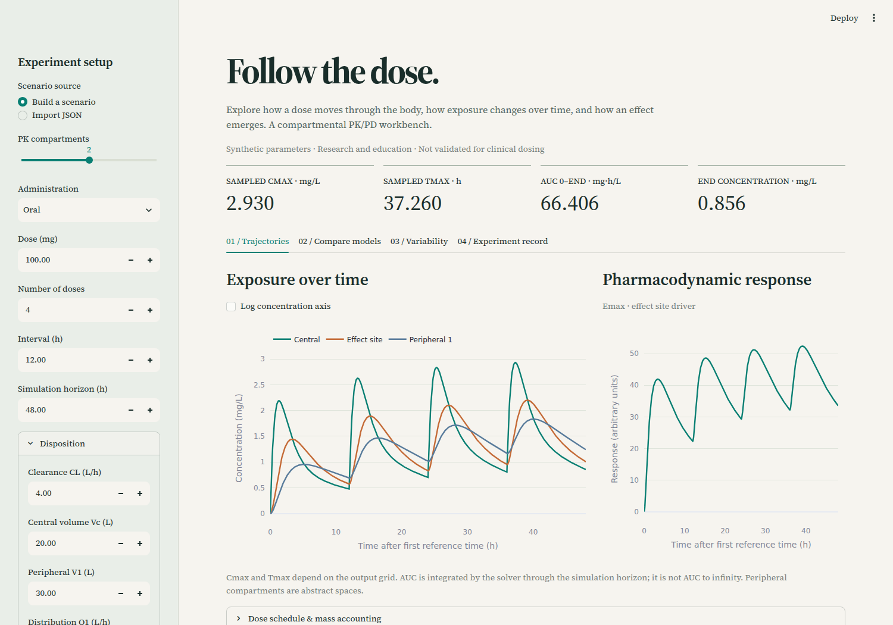

# PK/PD Lab

**Follow the dose.** An interactive research workbench and Python library for
exploring how administered drugs distribute, clear, and produce effects.

Build a scenario, compare 1-, 2-, and 3-compartment models, inspect concentration
and response curves, then export the complete experiment as JSON and CSV.

All bundled parameters are **synthetic**. This version is a general simulator,
not a validated drug model or clinical dosing tool.



## Run locally

Install [uv](https://docs.astral.sh/uv/getting-started/installation/), then:

```bash
git clone https://github.com/UMwai/pkpd-lab.git
cd pkpd-lab
uv sync --locked
uv run streamlit run app.py
```

Open **http://localhost:8501**. The app binds to localhost, makes no external
inference calls, and requires no API keys or cloud services. Python 3.11–3.13 is
covered by CI; the default development version is 3.12.

## Included in v0.1

| Area | Implemented |
| --- | --- |
| Distribution | 1-, 2-, and 3-compartment mammillary PK, parameterized with volumes and clearances |
| Administration | Oral, IV bolus, finite IV infusion, mixed routes, repeated and irregular doses, overlapping infusions |
| Absorption | First-order oral depot, bioavailability, fixed lag |
| Elimination | Linear clearance, Michaelis–Menten elimination, or both |
| Drug effects | Linear and sigmoid Emax; immediate plasma or delayed effect-site driver |
| Turnover response | Inhibition or stimulation of response production with first-order loss |
| Experiments | Structural comparisons, one-at-a-time sensitivity, seeded virtual CL/Vc variability |
| Outputs | Concentrations, amounts, effects, sampled Cmax/Tmax, integrated finite-horizon AUC, mass balance |
| Reproducibility | Validated versioned scenarios, parameter provenance, CSV/JSON export, CLI receipts, locked dependencies |

Compartment counts exclude the absorption depot and virtual effect site.
Compartments represent abstract distribution spaces, not named organs.

## Python example

```python
from pkpd_lab import PKParameters, Scenario, repeated_doses, simulate

scenario = Scenario(
    pk=PKParameters(
        clearance_l_h=4,
        central_volume_l=20,
        peripheral_volumes_l=(30, 80),
        intercompartmental_clearances_l_h=(6, 3),
        absorption_rate_h=1.2,
        bioavailability=0.8,
    ),
    doses=repeated_doses(100, interval_h=12, count=4),
    end_h=72,
)
result = simulate(scenario)
print(result.summary())
result.frame.to_csv("trajectory.csv", index=False)
```

To represent a missed dose, remove that dose event. Loading doses, variable amounts,
and combinations of routes are explicit `Dose` records. For a one-compartment
model, pass empty tuples for peripheral volumes and distribution clearances.

## Reproduce an experiment from the command line

```bash
uv run pkpd examples/repeated_oral.json --output outputs/repeated_oral.csv
uv run pkpd examples/three_compartment_infusion.json --output outputs/infusion.csv
uv run pkpd examples/saturable_indirect.json --output outputs/indirect.csv
```

Each command writes a trajectory CSV and a companion JSON containing the resolved
scenario, its SHA-256, dependency versions, solver tolerances, and summary metrics.
The UI can import the standalone scenario JSON. The companion receipt wraps it
under `scenario`; extract that field before importing a CLI receipt.

## Scientific contract

- Time: **h**. Amount: **mg**. Volume: **L**. Concentration: **mg/L**.
  Clearance/distribution clearance: **L/h**. Rate constants: **1/h**.
- Drug-free initial conditions at time zero; turnover response starts at baseline.
- Integration restarts at every dosing/infusion boundary. A value at a bolus time
  is **post-dose**; this matters when comparing with experimental observations.
- AUC is integrated as a state variable from zero to the chosen end time. There
  is no extrapolation to infinity, automatic steady-state claim, or terminal
  half-life estimate. Cmax and Tmax are sampled-grid estimates.
- Virtual-population bands reflect specified independent lognormal variability
  in CL and Vc. They are not fitted confidence intervals or clinical predictions.
- Drug-specific parameters need source, formulation, population, route, units,
  and validation context. A source citation alone does not validate a scenario.

See [equations and numerical conventions](docs/MODELS.md),
[validation evidence and limits](docs/VALIDATION.md), and
[the extension roadmap](docs/ROADMAP.md).

## Develop

```bash
uv sync --locked
uv run ruff check .
uv run ruff format --check .
uv run pytest
```

The tests compare the engine with independent analytical solutions and matrix
exponentials, check event semantics and mass balance, exercise the UI, and verify
CLI reproducibility receipts. These checks verify implementation behavior;
empirical validation against a drug dataset is separate work.

## References and license

Model design references are recorded in [docs/REFERENCES.md](docs/REFERENCES.md),
including mrgsolve, Torsten, and FDA population-PK guidance. This implementation
does not wrap or claim equivalence certification from those projects.

MIT license; see [LICENSE](LICENSE).
